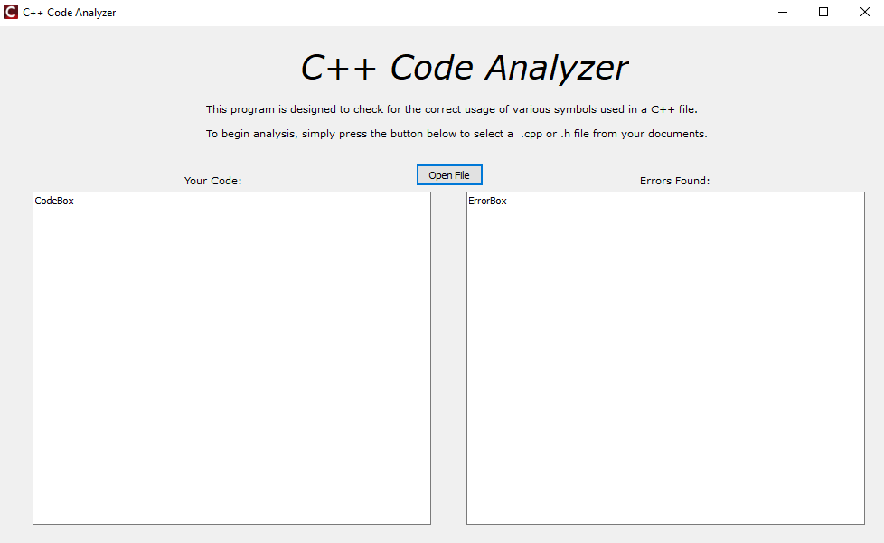

# Project Overview

This repository contains the project files used for a C++ analysis that I worked on previously. Note that this project includes only the files needed to compile the project in **C++ Builder**. 

If you are interested in running the project yourself, make sure to download and use the newest version of C++ Builder (the project was built using Version 12).

---

## How to Build This Project

1. Open the project in **C++ Builder**:
   - Go to **File** > **Open Project** and select `Project1.cbproj`.

2. Build the project:
   - Go to **Project** > **Build Project1**.

3. Once the project is built, you can run it:
   - Click the **green arrow** at the top to run the project.

The project should launch as a VCL Form, as shown below:

 

---

## Additional Notes

- Make sure you're using **C++ Builder version 12** or higher to avoid compatibility issues.
- This repository contains only the necessary files for compiling. If you encounter any issues, ensure your C++ Builder environment is correctly set up.

